# udacity-data-analyst-investigate-appointments


# Project: Investigate a Dataset (Medical Appointment No Shows in Brazil)

## Table of Contents
<ul>
<li><a href="#intro">Introduction</a></li>
<li><a href="#wrangling">Data Wrangling</a></li>
<li><a href="#eda">Exploratory Data Analysis</a></li>
<li><a href="#conclusions">Conclusions</a></li>
</ul>

<a id='intro'></a>
## Introduction

**The 'noshowappointments' dataset shows records of patients of different genders and age groups with various health problems living in Brazil. The motivation for this dataset was to investigate if the patient showed up to their doctor's appointment or they did not.**  
**The dataset consists of 110527 observations and 13 variables. The dataset investigations will be as follows :**

**1. Investigate the proportion of patients who :**  
    **- have hypertension compared to those who do not**    
    **- have diabetes compared to those who do not**  
    **- have alcoholism compared to those who do not**  
    **- are handicap compared to those who are not**  
    
**2. The relationship between the age of the patients and their occurrence of hypertension, diabetes, alcoholism and handicap status.**  

**3. The relationship between the number of doctors' visits and the season (summer or winter) in Brazil.**  

**4. The relationship between a patient showing up for a doctor's appointment and receiving a text.**  
    


### The URL where the dataset was derived from 
https://www.kaggle.com/joniarroba/noshowappointments

### The data dicitonary
Data Dictionary
#### 01 - PatientId
Identification of a patient
#### 02 - AppointmentID
Identification of each appointment
#### 03 - Gender
Male or Female . Female is the greater proportion ; women take more care of their health in comparison to men.
#### 04 - ScheduledDay
The day of the actual appointment, when they have to visit the doctor.
#### 05 - AppointmentDay
The day someone called or registered the appointment, this is before appointment of course.
#### 06 - Age
How old is the patient.
#### 07 - Neighborhood 
Where the appointment takes place.
#### 08 - Scholarship - Free Education to Children 
True or False
#### 09 - Hypertension
True or False
#### 10 - Diabetes
True or False
#### Alcoholism
True or False
#### Handicap
True or False
#### SMS_received - 1 or more messages sent to the patient
True or False
#### No-show
True or False


```python
# Import all necessary libraries for the project
import numpy as np
import pandas as pd
import matplotlib.pyplot as plt
import seaborn as sns
%matplotlib inline
# suppress warnings
import warnings
warnings.filterwarnings('ignore')
```

##### Use Panda functions to view the 'noshowappointments' dataset for data cleaning. 


```python
# Load the "noshowappointments" dataset as pandas dataframe and show a few records
df_medical = pd.read_csv('noshowappointments.csv')
df_medical.head()
```


<div>
<style scoped>
    .dataframe tbody tr th:only-of-type {
        vertical-align: middle;
    }

    .dataframe tbody tr th {
        vertical-align: top;
    }

    .dataframe thead th {
        text-align: right;
    }
</style>
<table border="1" class="dataframe">
  <thead>
    <tr style="text-align: right;">
      <th></th>
      <th>PatientId</th>
      <th>AppointmentID</th>
      <th>Gender</th>
      <th>ScheduledDay</th>
      <th>AppointmentDay</th>
      <th>Age</th>
      <th>Neighbourhood</th>
      <th>Scholarship</th>
      <th>Hipertension</th>
      <th>Diabetes</th>
      <th>Alcoholism</th>
      <th>Handcap</th>
      <th>SMS_received</th>
      <th>No-show</th>
    </tr>
  </thead>
  <tbody>
    <tr>
      <th>0</th>
      <td>2.987250e+13</td>
      <td>5642903</td>
      <td>F</td>
      <td>2016-04-29T18:38:08Z</td>
      <td>2016-04-29T00:00:00Z</td>
      <td>62</td>
      <td>JARDIM DA PENHA</td>
      <td>0</td>
      <td>1</td>
      <td>0</td>
      <td>0</td>
      <td>0</td>
      <td>0</td>
      <td>No</td>
    </tr>
    <tr>
      <th>1</th>
      <td>5.589978e+14</td>
      <td>5642503</td>
      <td>M</td>
      <td>2016-04-29T16:08:27Z</td>
      <td>2016-04-29T00:00:00Z</td>
      <td>56</td>
      <td>JARDIM DA PENHA</td>
      <td>0</td>
      <td>0</td>
      <td>0</td>
      <td>0</td>
      <td>0</td>
      <td>0</td>
      <td>No</td>
    </tr>
    <tr>
      <th>2</th>
      <td>4.262962e+12</td>
      <td>5642549</td>
      <td>F</td>
      <td>2016-04-29T16:19:04Z</td>
      <td>2016-04-29T00:00:00Z</td>
      <td>62</td>
      <td>MATA DA PRAIA</td>
      <td>0</td>
      <td>0</td>
      <td>0</td>
      <td>0</td>
      <td>0</td>
      <td>0</td>
      <td>No</td>
    </tr>
    <tr>
      <th>3</th>
      <td>8.679512e+11</td>
      <td>5642828</td>
      <td>F</td>
      <td>2016-04-29T17:29:31Z</td>
      <td>2016-04-29T00:00:00Z</td>
      <td>8</td>
      <td>PONTAL DE CAMBURI</td>
      <td>0</td>
      <td>0</td>
      <td>0</td>
      <td>0</td>
      <td>0</td>
      <td>0</td>
      <td>No</td>
    </tr>
    <tr>
      <th>4</th>
      <td>8.841186e+12</td>
      <td>5642494</td>
      <td>F</td>
      <td>2016-04-29T16:07:23Z</td>
      <td>2016-04-29T00:00:00Z</td>
      <td>56</td>
      <td>JARDIM DA PENHA</td>
      <td>0</td>
      <td>1</td>
      <td>1</td>
      <td>0</td>
      <td>0</td>
      <td>0</td>
      <td>No</td>
    </tr>
  </tbody>
</table>
</div>


##### <span style="color:red">1. Conclusion : The dataset contains 14 columns where columns 'Neighbourhood', 'Hipertension' , 'Handcap' are spelled incorrectly. The variable names can also be simplified by using lowercase and underscore. </span>


```python
# Examine columns which are have few unique value and can be dropped
print(f'Number of rows, columns in dataframe : {df_medical.shape}')
print(f'Number of unique rows in PatientId column : {df_medical.PatientId.nunique()}')
print(f'Number of unique rows in AppointmentID column : {df_medical.AppointmentID.nunique()}')
print(f'Number of unique rows in ScheduledDay column : {df_medical.ScheduledDay.nunique()}')
print(f'Number of unique rows in AppointmentDay column : {df_medical.AppointmentDay.nunique()}')
```

    Number of rows, columns in dataframe : (110527, 14)
    Number of unique rows in PatientId column : 62299
    Number of unique rows in AppointmentID column : 110527
    Number of unique rows in ScheduledDay column : 103549
    Number of unique rows in AppointmentDay column : 27


##### <span style="color:red">2. Conclusion : The column 'AppointmentDay' which not have many unique rows and does not give us any useful information can be dropped.</span>


```python
# check for datatypes in each column 
print(df_medical.info())
# check for missing values in each column
print(f'Count the number of missing values in each column : \n{df_medical.isnull().sum()}')
```

    <class 'pandas.core.frame.DataFrame'>
    RangeIndex: 110527 entries, 0 to 110526
    Data columns (total 14 columns):
     #   Column          Non-Null Count   Dtype  
    ---  ------          --------------   -----  
     0   PatientId       110527 non-null  float64
     1   AppointmentID   110527 non-null  int64  
     2   Gender          110527 non-null  object 
     3   ScheduledDay    110527 non-null  object 
     4   AppointmentDay  110527 non-null  object 
     5   Age             110527 non-null  int64  
     6   Neighbourhood   110527 non-null  object 
     7   Scholarship     110527 non-null  int64  
     8   Hipertension    110527 non-null  int64  
     9   Diabetes        110527 non-null  int64  
     10  Alcoholism      110527 non-null  int64  
     11  Handcap         110527 non-null  int64  
     12  SMS_received    110527 non-null  int64  
     13  No-show         110527 non-null  object 
    dtypes: float64(1), int64(8), object(5)
    memory usage: 11.8+ MB
    None
    Count the number of missing values in each column : 
    PatientId         0
    AppointmentID     0
    Gender            0
    ScheduledDay      0
    AppointmentDay    0
    Age               0
    Neighbourhood     0
    Scholarship       0
    Hipertension      0
    Diabetes          0
    Alcoholism        0
    Handcap           0
    SMS_received      0
    No-show           0
    dtype: int64


##### <span style="color:red">3. Conclusion :  There are no missing values in the dataframe.<br /> The following datatypes can be changed :<br /> ' PatientId'  ( float to integer),&nbsp; 'ScheduledDay' (object to datetime )&nbsp; ,'Scholarship'( int to boolean),&nbsp;<br /> 'Hypertension (int to boolean),&nbsp;'Diabetes' (int to boolean),&nbsp;'Alcoholism' (int to boolean),<br /> 'Handicap' (int to boolean),&nbsp;'SMS_received (int to boolean),&nbsp; 'No-show' (object to boolean).</span> 


```python
# summary statistics for numerical columns
df_medical.describe()
```


<div>
<style scoped>
    .dataframe tbody tr th:only-of-type {
        vertical-align: middle;
    }

    .dataframe tbody tr th {
        vertical-align: top;
    }

    .dataframe thead th {
        text-align: right;
    }
</style>
<table border="1" class="dataframe">
  <thead>
    <tr style="text-align: right;">
      <th></th>
      <th>PatientId</th>
      <th>AppointmentID</th>
      <th>Age</th>
      <th>Scholarship</th>
      <th>Hipertension</th>
      <th>Diabetes</th>
      <th>Alcoholism</th>
      <th>Handcap</th>
      <th>SMS_received</th>
    </tr>
  </thead>
  <tbody>
    <tr>
      <th>count</th>
      <td>1.105270e+05</td>
      <td>1.105270e+05</td>
      <td>110527.000000</td>
      <td>110527.000000</td>
      <td>110527.000000</td>
      <td>110527.000000</td>
      <td>110527.000000</td>
      <td>110527.000000</td>
      <td>110527.000000</td>
    </tr>
    <tr>
      <th>mean</th>
      <td>1.474963e+14</td>
      <td>5.675305e+06</td>
      <td>37.088874</td>
      <td>0.098266</td>
      <td>0.197246</td>
      <td>0.071865</td>
      <td>0.030400</td>
      <td>0.022248</td>
      <td>0.321026</td>
    </tr>
    <tr>
      <th>std</th>
      <td>2.560949e+14</td>
      <td>7.129575e+04</td>
      <td>23.110205</td>
      <td>0.297675</td>
      <td>0.397921</td>
      <td>0.258265</td>
      <td>0.171686</td>
      <td>0.161543</td>
      <td>0.466873</td>
    </tr>
    <tr>
      <th>min</th>
      <td>3.921784e+04</td>
      <td>5.030230e+06</td>
      <td>-1.000000</td>
      <td>0.000000</td>
      <td>0.000000</td>
      <td>0.000000</td>
      <td>0.000000</td>
      <td>0.000000</td>
      <td>0.000000</td>
    </tr>
    <tr>
      <th>25%</th>
      <td>4.172614e+12</td>
      <td>5.640286e+06</td>
      <td>18.000000</td>
      <td>0.000000</td>
      <td>0.000000</td>
      <td>0.000000</td>
      <td>0.000000</td>
      <td>0.000000</td>
      <td>0.000000</td>
    </tr>
    <tr>
      <th>50%</th>
      <td>3.173184e+13</td>
      <td>5.680573e+06</td>
      <td>37.000000</td>
      <td>0.000000</td>
      <td>0.000000</td>
      <td>0.000000</td>
      <td>0.000000</td>
      <td>0.000000</td>
      <td>0.000000</td>
    </tr>
    <tr>
      <th>75%</th>
      <td>9.439172e+13</td>
      <td>5.725524e+06</td>
      <td>55.000000</td>
      <td>0.000000</td>
      <td>0.000000</td>
      <td>0.000000</td>
      <td>0.000000</td>
      <td>0.000000</td>
      <td>1.000000</td>
    </tr>
    <tr>
      <th>max</th>
      <td>9.999816e+14</td>
      <td>5.790484e+06</td>
      <td>115.000000</td>
      <td>1.000000</td>
      <td>1.000000</td>
      <td>1.000000</td>
      <td>1.000000</td>
      <td>4.000000</td>
      <td>1.000000</td>
    </tr>
  </tbody>
</table>
</div>


```python
# Filter the row that has age equal to -1
print(df_medical[df_medical.Age == -1])
```

              PatientId  AppointmentID Gender          ScheduledDay  \
    99832  4.659432e+14        5775010      F  2016-06-06T08:58:13Z   
    
                 AppointmentDay  Age Neighbourhood  Scholarship  Hipertension  \
    99832  2016-06-06T00:00:00Z   -1         ROMÃO            0             0   
    
           Diabetes  Alcoholism  Handcap  SMS_received No-show  
    99832         0           0        0             0      No  


##### <span style="color:red">4. Conclusion : The 'age' variable has a minimum of '-1' which does not make sense. Row 99832 contains the value -1 for 'Age'. This value can be replaced by the mean of the 'age' column.</span>


```python
# Find the names of the columns in the dataframe
df_medical.columns
```


    Index(['PatientId', 'AppointmentID', 'Gender', 'ScheduledDay',
           'AppointmentDay', 'Age', 'Neighbourhood', 'Scholarship', 'Hipertension',
           'Diabetes', 'Alcoholism', 'Handcap', 'SMS_received', 'No-show'],
          dtype='object')


##### <span style="color:red">5. Conclusion : Split the main dataframe into two dataframes that follow the logic of the columns.</span>
<span style="color:red">The first dataframe will consist of columns refering only to the patient ( PatientId, Gender, Age, Neighborhood, Scholorship, Hypertension, Diabetes, Alcoholism, Handicap ).</span><br />
<span style="color:red">The second dataframe will consist of columns that give information about the appointments (a patient can have more than one appointment).</span> <br /> 
<span style="color:red">The columns are AppointmentID, ScheduledDay, SMS_received, and No-show.</span> 


### Data Cleaning ( Drop unnessary column, replace erroneous values, change datatypes, and fix spelling errors )

##### <span style="color:red">Fix conclusion 1 : column spelling errors</span> 

Index(['PatientId', 'AppointmentID', 'Gender', 'ScheduledDay',
       'AppointmentDay', 'Age', 'Neighbourhood', 'Scholarship', 'Hipertension',
       'Diabetes', 'Alcoholism', 'Handcap', 'SMS_received', 'No-show'],
      dtype='object')


```python
# rename columns 'Hipertension' and 'Handcap' to correct spelling
df_medical.rename(columns = \
                  {'PatientId':'patient_id','AppointmentID':'appointment_id','Gender':'gender', 'ScheduledDay': \
                   'scheduled_day','AppointmentDay':'appointment_day','Age':'age','Neighbourhood' : 'neighborhood', \
                   'Scholarship':'scholarship','Hipertension':'hypertension','Diabetes':'diabetes','Alcoholism' : \
                   'alcoholism','Handcap':'handicap','SMS_received':'sms_received','No-show':'no_show'},\
                  inplace = True)                    
                             
df_medical.head(1)
```


<div>
<style scoped>
    .dataframe tbody tr th:only-of-type {
        vertical-align: middle;
    }

    .dataframe tbody tr th {
        vertical-align: top;
    }

    .dataframe thead th {
        text-align: right;
    }
</style>
<table border="1" class="dataframe">
  <thead>
    <tr style="text-align: right;">
      <th></th>
      <th>patient_id</th>
      <th>appointment_id</th>
      <th>gender</th>
      <th>scheduled_day</th>
      <th>appointment_day</th>
      <th>age</th>
      <th>neighborhood</th>
      <th>scholarship</th>
      <th>hypertension</th>
      <th>diabetes</th>
      <th>alcoholism</th>
      <th>handicap</th>
      <th>sms_received</th>
      <th>no_show</th>
    </tr>
  </thead>
  <tbody>
    <tr>
      <th>0</th>
      <td>2.987250e+13</td>
      <td>5642903</td>
      <td>F</td>
      <td>2016-04-29T18:38:08Z</td>
      <td>2016-04-29T00:00:00Z</td>
      <td>62</td>
      <td>JARDIM DA PENHA</td>
      <td>0</td>
      <td>1</td>
      <td>0</td>
      <td>0</td>
      <td>0</td>
      <td>0</td>
      <td>No</td>
    </tr>
  </tbody>
</table>
</div>


##### <span style="color:red">Fix Conclusion 2 : Drop "AppointmentDay' column</span>


```python
# Drop 'AppointmentDay' column
df_medical = df_medical.drop(['appointment_day'], axis=1)
df_medical.head(3)
```


<div>
<style scoped>
    .dataframe tbody tr th:only-of-type {
        vertical-align: middle;
    }

    .dataframe tbody tr th {
        vertical-align: top;
    }

    .dataframe thead th {
        text-align: right;
    }
</style>
<table border="1" class="dataframe">
  <thead>
    <tr style="text-align: right;">
      <th></th>
      <th>patient_id</th>
      <th>appointment_id</th>
      <th>gender</th>
      <th>scheduled_day</th>
      <th>age</th>
      <th>neighborhood</th>
      <th>scholarship</th>
      <th>hypertension</th>
      <th>diabetes</th>
      <th>alcoholism</th>
      <th>handicap</th>
      <th>sms_received</th>
      <th>no_show</th>
    </tr>
  </thead>
  <tbody>
    <tr>
      <th>0</th>
      <td>2.987250e+13</td>
      <td>5642903</td>
      <td>F</td>
      <td>2016-04-29T18:38:08Z</td>
      <td>62</td>
      <td>JARDIM DA PENHA</td>
      <td>0</td>
      <td>1</td>
      <td>0</td>
      <td>0</td>
      <td>0</td>
      <td>0</td>
      <td>No</td>
    </tr>
    <tr>
      <th>1</th>
      <td>5.589978e+14</td>
      <td>5642503</td>
      <td>M</td>
      <td>2016-04-29T16:08:27Z</td>
      <td>56</td>
      <td>JARDIM DA PENHA</td>
      <td>0</td>
      <td>0</td>
      <td>0</td>
      <td>0</td>
      <td>0</td>
      <td>0</td>
      <td>No</td>
    </tr>
    <tr>
      <th>2</th>
      <td>4.262962e+12</td>
      <td>5642549</td>
      <td>F</td>
      <td>2016-04-29T16:19:04Z</td>
      <td>62</td>
      <td>MATA DA PRAIA</td>
      <td>0</td>
      <td>0</td>
      <td>0</td>
      <td>0</td>
      <td>0</td>
      <td>0</td>
      <td>No</td>
    </tr>
  </tbody>
</table>
</div>


##### <span style="color:red">Fix Conclusion 3 : Fix Datatypes for nine columns ( PatientID, ScheduleDay, Scholorship, Hypertension, Diabetes, Alcoholism, Handicap, SMS_received, No-show)</span> 


```python
# convert ScheduleDay to timestamp
df_medical['scheduled_day'] = pd.to_datetime(df_medical['scheduled_day'], format="%Y-%m-%dT%H:%M:%SZ")
```


```python
# print datatype for ScheduleDay
print(df_medical.scheduled_day.head(1))
print(df_medical.scheduled_day.dtypes)
```

    0   2016-04-29 18:38:08
    Name: scheduled_day, dtype: datetime64[ns]
    datetime64[ns]


```python
# Convert PatientId datatype from float to int
df_medical['patient_id'] = df_medical['patient_id'].astype(int)
print(df_medical.patient_id.head(1))
print(df_medical.patient_id.dtypes)
```

    0    29872499824296
    Name: patient_id, dtype: int64
    int64


```python
# Convert the last 7 columns to boolean ( Scholarship, Hypertension, Diabetes, Alcoholism, Handicap, 
# SMS_received, No-show)
df_medical[['scholarship', 'hypertension','diabetes','alcoholism','handicap','sms_received']] = \
df_medical[['scholarship', 'hypertension','diabetes','alcoholism','handicap','sms_received']].astype(bool)
```


```python
df_medical.head(2)
```


<div>
<style scoped>
    .dataframe tbody tr th:only-of-type {
        vertical-align: middle;
    }

    .dataframe tbody tr th {
        vertical-align: top;
    }

    .dataframe thead th {
        text-align: right;
    }
</style>
<table border="1" class="dataframe">
  <thead>
    <tr style="text-align: right;">
      <th></th>
      <th>patient_id</th>
      <th>appointment_id</th>
      <th>gender</th>
      <th>scheduled_day</th>
      <th>age</th>
      <th>neighborhood</th>
      <th>scholarship</th>
      <th>hypertension</th>
      <th>diabetes</th>
      <th>alcoholism</th>
      <th>handicap</th>
      <th>sms_received</th>
      <th>no_show</th>
    </tr>
  </thead>
  <tbody>
    <tr>
      <th>0</th>
      <td>29872499824296</td>
      <td>5642903</td>
      <td>F</td>
      <td>2016-04-29 18:38:08</td>
      <td>62</td>
      <td>JARDIM DA PENHA</td>
      <td>False</td>
      <td>True</td>
      <td>False</td>
      <td>False</td>
      <td>False</td>
      <td>False</td>
      <td>No</td>
    </tr>
    <tr>
      <th>1</th>
      <td>558997776694438</td>
      <td>5642503</td>
      <td>M</td>
      <td>2016-04-29 16:08:27</td>
      <td>56</td>
      <td>JARDIM DA PENHA</td>
      <td>False</td>
      <td>False</td>
      <td>False</td>
      <td>False</td>
      <td>False</td>
      <td>False</td>
      <td>No</td>
    </tr>
  </tbody>
</table>
</div>


```python
# list the datatypes to df_medical
df_medical.dtypes
```


    patient_id                 int64
    appointment_id             int64
    gender                    object
    scheduled_day     datetime64[ns]
    age                        int64
    neighborhood              object
    scholarship                 bool
    hypertension                bool
    diabetes                    bool
    alcoholism                  bool
    handicap                    bool
    sms_received                bool
    no_show                   object
    dtype: object


##### <span style="color:red">Fix Conclusion 4 : Replace the row with age equal to -1 with mean of age</span>


```python
# Filter the row with Age equal to -1 
print(df_medical[df_medical.age == -1])
```

                patient_id  appointment_id gender       scheduled_day  age  \
    99832  465943158731293         5775010      F 2016-06-06 08:58:13   -1   
    
          neighborhood  scholarship  hypertension  diabetes  alcoholism  handicap  \
    99832        ROMÃO        False         False     False       False     False   
    
           sms_received no_show  
    99832         False      No  


```python
# Find the mean to Age
age_mean = df_medical.age.mean()
age_mean
```


    37.08887421173107


```python
# replace value 'Age' column in row 99832
df_medical["age"].replace({-1: 37}, inplace=True)
```


```python
# print the row where Age of -1 is replaced
print(df_medical[df_medical.appointment_id == 5775010])
```

                patient_id  appointment_id gender       scheduled_day  age  \
    99832  465943158731293         5775010      F 2016-06-06 08:58:13   37   
    
          neighborhood  scholarship  hypertension  diabetes  alcoholism  handicap  \
    99832        ROMÃO        False         False     False       False     False   
    
           sms_received no_show  
    99832         False      No  


##### <span style="color:red">Fix Conclusion 5 : Split Dataframe into two dataframes ( one for patients and the other for appointments ) and drop duplicates in ID columns in both dataframes.</span> 


```python
# Find number of rows and columns
df_medical.shape
```


    (110527, 13)


```python
# Create a dataframe containing patient data
df_patients = df_medical[['patient_id','gender','age','neighborhood','scholarship','hypertension','diabetes',\
                         'alcoholism','handicap']]
df_patients.head(3)
```


<div>
<style scoped>
    .dataframe tbody tr th:only-of-type {
        vertical-align: middle;
    }

    .dataframe tbody tr th {
        vertical-align: top;
    }

    .dataframe thead th {
        text-align: right;
    }
</style>
<table border="1" class="dataframe">
  <thead>
    <tr style="text-align: right;">
      <th></th>
      <th>patient_id</th>
      <th>gender</th>
      <th>age</th>
      <th>neighborhood</th>
      <th>scholarship</th>
      <th>hypertension</th>
      <th>diabetes</th>
      <th>alcoholism</th>
      <th>handicap</th>
    </tr>
  </thead>
  <tbody>
    <tr>
      <th>0</th>
      <td>29872499824296</td>
      <td>F</td>
      <td>62</td>
      <td>JARDIM DA PENHA</td>
      <td>False</td>
      <td>True</td>
      <td>False</td>
      <td>False</td>
      <td>False</td>
    </tr>
    <tr>
      <th>1</th>
      <td>558997776694438</td>
      <td>M</td>
      <td>56</td>
      <td>JARDIM DA PENHA</td>
      <td>False</td>
      <td>False</td>
      <td>False</td>
      <td>False</td>
      <td>False</td>
    </tr>
    <tr>
      <th>2</th>
      <td>4262962299951</td>
      <td>F</td>
      <td>62</td>
      <td>MATA DA PRAIA</td>
      <td>False</td>
      <td>False</td>
      <td>False</td>
      <td>False</td>
      <td>False</td>
    </tr>
  </tbody>
</table>
</div>


```python
# Find number of rows and columns in df_patients
df_patients.shape
```


    (110527, 9)


```python
# Count number of PatientIds that are unique which represents a single patient 
df_patients['patient_id'].nunique()
```


    62299


```python
# Drop the duplicate PatientIds. Each PatientId represents a patient so duplicates are not needed. 
df_patients = df_patients.drop_duplicates(['patient_id']).reset_index(drop=True)
df_patients.shape
```


    (62299, 9)


**Note : duplicate rows for PatientId in df_patients were dropped.**  


```python
# print first two rows
df_patients.head(2)
```


<div>
<style scoped>
    .dataframe tbody tr th:only-of-type {
        vertical-align: middle;
    }

    .dataframe tbody tr th {
        vertical-align: top;
    }

    .dataframe thead th {
        text-align: right;
    }
</style>
<table border="1" class="dataframe">
  <thead>
    <tr style="text-align: right;">
      <th></th>
      <th>patient_id</th>
      <th>gender</th>
      <th>age</th>
      <th>neighborhood</th>
      <th>scholarship</th>
      <th>hypertension</th>
      <th>diabetes</th>
      <th>alcoholism</th>
      <th>handicap</th>
    </tr>
  </thead>
  <tbody>
    <tr>
      <th>0</th>
      <td>29872499824296</td>
      <td>F</td>
      <td>62</td>
      <td>JARDIM DA PENHA</td>
      <td>False</td>
      <td>True</td>
      <td>False</td>
      <td>False</td>
      <td>False</td>
    </tr>
    <tr>
      <th>1</th>
      <td>558997776694438</td>
      <td>M</td>
      <td>56</td>
      <td>JARDIM DA PENHA</td>
      <td>False</td>
      <td>False</td>
      <td>False</td>
      <td>False</td>
      <td>False</td>
    </tr>
  </tbody>
</table>
</div>


```python
# Create a dataframe containing appointment data with at least one quantitative variable (age)
df_appoint = df_medical[['appointment_id', 'scheduled_day','age','sms_received', 'no_show']]
df_appoint.head(3)
```


<div>
<style scoped>
    .dataframe tbody tr th:only-of-type {
        vertical-align: middle;
    }

    .dataframe tbody tr th {
        vertical-align: top;
    }

    .dataframe thead th {
        text-align: right;
    }
</style>
<table border="1" class="dataframe">
  <thead>
    <tr style="text-align: right;">
      <th></th>
      <th>appointment_id</th>
      <th>scheduled_day</th>
      <th>age</th>
      <th>sms_received</th>
      <th>no_show</th>
    </tr>
  </thead>
  <tbody>
    <tr>
      <th>0</th>
      <td>5642903</td>
      <td>2016-04-29 18:38:08</td>
      <td>62</td>
      <td>False</td>
      <td>No</td>
    </tr>
    <tr>
      <th>1</th>
      <td>5642503</td>
      <td>2016-04-29 16:08:27</td>
      <td>56</td>
      <td>False</td>
      <td>No</td>
    </tr>
    <tr>
      <th>2</th>
      <td>5642549</td>
      <td>2016-04-29 16:19:04</td>
      <td>62</td>
      <td>False</td>
      <td>No</td>
    </tr>
  </tbody>
</table>
</div>


```python
# count number of rows and columns in df_appoint
df_appoint.shape
```


    (110527, 5)


```python
# Count number of AppointmentID that are unique which represents a single appointment (not a single patient)
df_appoint['appointment_id'].nunique()
```


    110527


**Note : No duplicate rows for AppointmentID in df_appoint were found.** 

<a id='eda'></a>
## Exploratory Data Analysis


### <span style="background-color:yellow"> Exploration 1 (Univariate Analysis)</span> 
**1. Investigate the proportion of patients who :**  
    **- have hypertension compared to those who do not**    
    **- have diabetes compared to those who do not**  
    **- have alcoholism compared to those who do not**  
    **- are handicap compared to those who are not** 


```python
# check the few lines in the df_patients dataframe
df_patients.head(2)
```


<div>
<style scoped>
    .dataframe tbody tr th:only-of-type {
        vertical-align: middle;
    }

    .dataframe tbody tr th {
        vertical-align: top;
    }

    .dataframe thead th {
        text-align: right;
    }
</style>
<table border="1" class="dataframe">
  <thead>
    <tr style="text-align: right;">
      <th></th>
      <th>patient_id</th>
      <th>gender</th>
      <th>age</th>
      <th>neighborhood</th>
      <th>scholarship</th>
      <th>hypertension</th>
      <th>diabetes</th>
      <th>alcoholism</th>
      <th>handicap</th>
    </tr>
  </thead>
  <tbody>
    <tr>
      <th>0</th>
      <td>29872499824296</td>
      <td>F</td>
      <td>62</td>
      <td>JARDIM DA PENHA</td>
      <td>False</td>
      <td>True</td>
      <td>False</td>
      <td>False</td>
      <td>False</td>
    </tr>
    <tr>
      <th>1</th>
      <td>558997776694438</td>
      <td>M</td>
      <td>56</td>
      <td>JARDIM DA PENHA</td>
      <td>False</td>
      <td>False</td>
      <td>False</td>
      <td>False</td>
      <td>False</td>
    </tr>
  </tbody>
</table>
</div>


```python
# find number of total patients
df_patients.shape[0]
```


    62299


```python
# plot of histogram for age
plt.hist(df_patients['age'], density=True, bins=40)
plt.title('Distribution of age for patients', fontweight='bold')
plt.xlabel('Age', fontweight='bold')
plt.show()
```


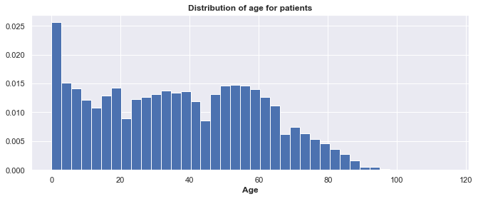


```python
# function to label countplot with percentages
def without_hue(plot, feature):
    total = len(feature)
    for p in ax.patches:
        percentage = '{:.1f}%'.format(100 * p.get_height()/total)
        x = p.get_x() + p.get_width() / 2 - 0.05
        y = p.get_y() + p.get_height()
        ax.annotate(percentage, (x, y), size = 16)
    plt.show()
```


```python
# Plot showing the proportion of 'hypertension' and 'no hypertension' in the patients dataset
ax = sns.countplot(x='hypertension', data=df_patients)
ax.set_xlabel('')
ax.set_xticklabels(['No Hypertension','Hypertension'], fontsize=15, fontweight='bold')
ax.set_yticklabels(['0','10000','20000','30000','40000','50000'],fontsize=10,fontweight='bold')
ax.set_ylabel('Count of patients', fontsize=15, fontweight='bold')
ax.set_title('Number of patients with hypertension compared to no hypertension', fontweight='bold',fontsize=15)
without_hue(ax, df_patients.hypertension)
```


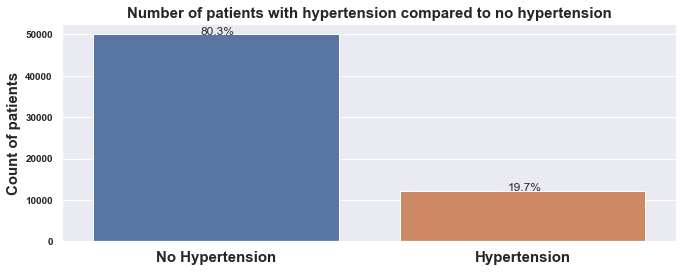


```python
# Plot showing the proportion of 'diabetes' and 'no diabetes' in the patients dataset
ax = sns.countplot(x='diabetes', data=df_patients)
ax.set_xlabel('')
ax.set_xticklabels(['No Diabetes','Diabetes'], fontsize=15, fontweight='bold')
ax.set_yticklabels(['0','10000','20000','30000','40000','50000'],fontsize=10,fontweight='bold')
ax.set_ylabel('Count of patients', fontsize=15, fontweight='bold')
ax.set_title('Number of patients with diabetes compared to no diabetes', fontweight='bold',fontsize=15)
without_hue(ax, df_patients.diabetes)
```


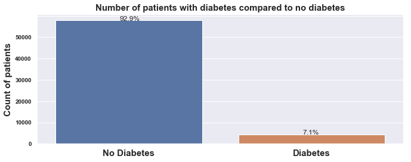


```python
# Plot showing the proportion of 'diabetes' and 'no diabetes' in the patients dataset
ax = sns.countplot(x='alcoholism', data=df_patients)
ax.set_xlabel('')
ax.set_xticklabels(['No Alcoholism','Alcoholism'], fontsize=15, fontweight='bold')
ax.set_yticklabels(['0','10000','20000','30000','40000','50000'],fontsize=10,fontweight='bold')
ax.set_ylabel('Count of patients', fontsize=15, fontweight='bold')
ax.set_title('Number of patients with alcoholism compared to no alcoholism', fontweight='bold',fontsize=15)
without_hue(ax, df_patients.alcoholism)
```


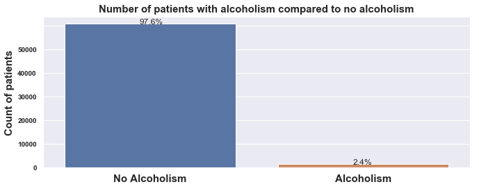


```python
# Plot showing the proportion of 'diabetes' and 'no diabetes' in the patients dataset
ax = sns.countplot(x='handicap', data=df_patients)
ax.set_xlabel('')
ax.set_xticklabels(['No Handicap','Handicap'], fontsize=15, fontweight='bold')
ax.set_yticklabels(['0','10000','20000','30000','40000','50000'],fontsize=10,fontweight='bold')
ax.set_ylabel('Count of patients', fontsize=15, fontweight='bold')
ax.set_title('Number of patients with handicap compared to no handicap', fontweight='bold',fontsize=15)
without_hue(ax, df_patients.handicap)
```


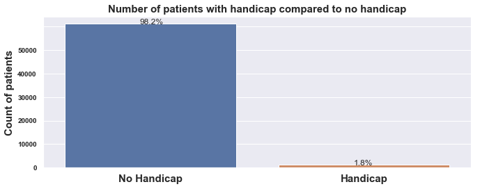


**<span style="background-color:yellow"> Conclusion for Exploration 1</span>**  

**Most of the patients in the datasest are between 1 to 62 years old therefore you would expect the patients to be in good health overall. Hypertension is the most common health problem at 20%. Diabetes is the second most common health problem. Alcoholism is significantly lower than diabetes and handicap is the least common.Both alcoholism and handicap are difficult to predict.The website https://www.ncbi.nlm.nih.gov/pmc/articles/PMC4355692/ states that "Adults with disabilities are 4 times more likely to report their health to be fair or poor than people with no disabilities".** 

### <span style="background-color:yellow"> Exploration 2 (Bivariate Analysis)</span>
**2. The relationship between the age of the patients and their occurrence of hypertension, diabetes, alcoholism and handicap status.**  


```python
# Plot shows the relationship between hypertension and age
plt.figure(figsize=(25,10))
sns.countplot(x='age', data = df_patients, hue='hypertension')
plt.xticks(rotation=90, fontweight='bold', fontsize=15)
plt.xlabel('Age',fontweight='bold', fontsize=20)
plt.ylabel('Number of patients', fontweight='bold', fontsize=20)
plt.xlim(20,90)
plt.ylim(0,1000)
plt.legend(['No Hypertension','Hypertension'],loc=2, prop={'size': 30})
plt.title('Number of patients with hypertension or no hypertension at a certain age', fontsize=20,fontweight='bold')
plt.show()
```


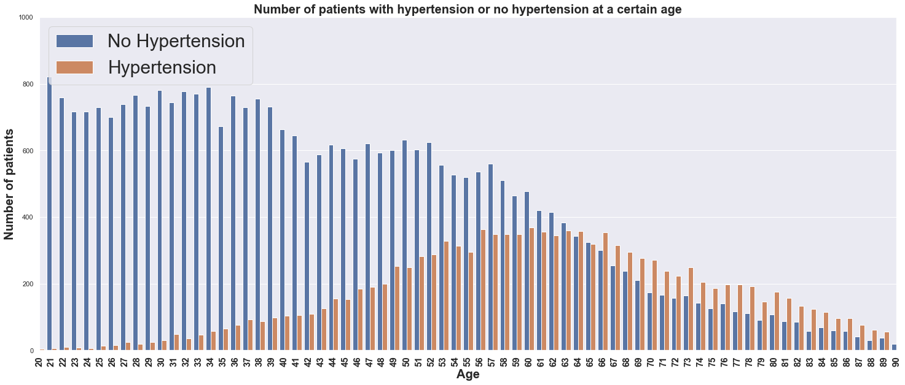


```python
# Plot to show relationshop between diabetes and age
plt.figure(figsize=(25,10))
sns.countplot(x='age', data = df_patients, hue='diabetes')
plt.xticks(rotation=90, fontweight='bold', fontsize=15)
plt.xlabel('Age',fontweight='bold', fontsize=20)
plt.ylabel('Number of patients', fontweight='bold', fontsize=20)
plt.xlim(20,90)
plt.ylim(0,1000)
plt.legend(['No Diabetes','Diabetes'],loc=2, prop={'size': 30})
plt.title('Number of patients with diabetes or no diabetes at a certain age', fontsize=20,fontweight='bold')
plt.show()
```


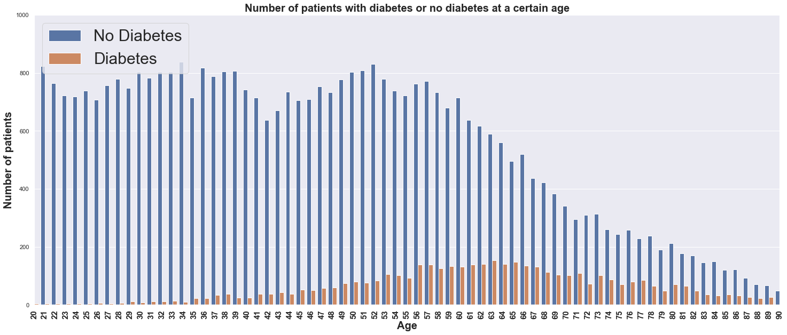


```python
# Plot to show relationshop between alcoholism and age
plt.figure(figsize=(25,10))
sns.countplot(x='age', data = df_patients, hue='alcoholism')
plt.xticks(rotation=90, fontweight='bold', fontsize=15)
plt.xlabel('Age',fontweight='bold', fontsize=20)
plt.ylabel('Number of patients', fontweight='bold', fontsize=20)
plt.xlim(20,90)
plt.ylim(0,1000)
plt.legend(['No Alcoholism','Alcoholism'],loc=2, prop={'size': 30})
plt.title('Number of patients with alcoholism or no alcoholism at a certain age', fontsize=20,fontweight='bold')
plt.show()
```


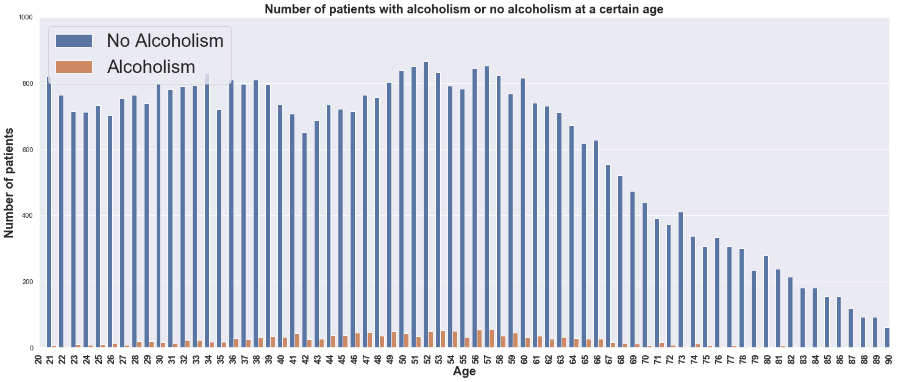


```python
# Plot to show is there is a relationshop between handicap and age
plt.figure(figsize=(25,10))
sns.countplot(x='age', data = df_patients, hue='handicap')
plt.xticks(rotation=90, fontweight='bold', fontsize=15)
plt.xlabel('Age',fontweight='bold', fontsize=20)
plt.ylabel('Number of patients', fontweight='bold', fontsize=20)
plt.xlim(20,90)
plt.ylim(0,1000)
plt.legend(['No Handicap','Handicap'],loc=2, prop={'size': 30})
plt.title('Number of patients with a handicap or no handicap at a certain age', fontsize=20,fontweight='bold')
plt.show()
```


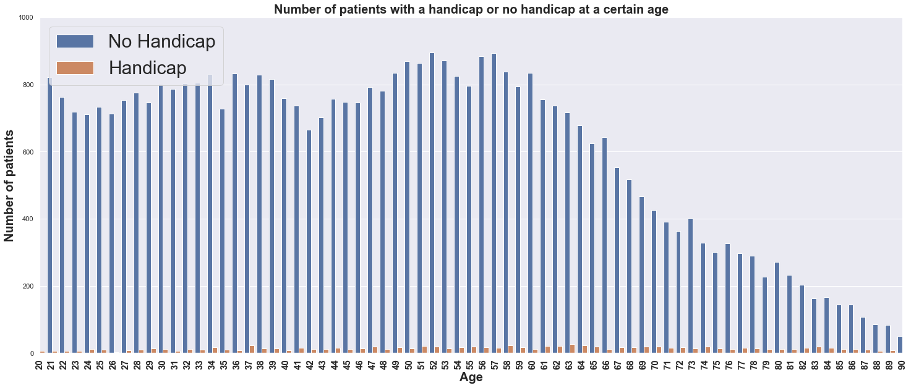


**<span style="background-color:yellow"> Conclusion for Exploration 2</span>**

**The histogram of age shows that most patients are between age 1 and age 60.** 
**As shown in the countplots above, at a given age the height of the bar representing the specific "health problem" is compared to the height of the bar for "no health problem.**  

**The following conclusions are made:**  

**1.At around 60 years old the number of patients with NO hypertension is reaching the number of patients with hypertension and then gradually outnumbering it.    
2.There is a gradual increase of diabetes over age 56.    
3.Alcoholism slightly increases between roughly ages 35 and 65. There is almost no cases of alcoholism in the very young and very old.  
4.Handicap does not have and increases or decreases with age as suspected. Handicap status is not an illness but more of an unpredictable health issue.** 

### <span style="background-color:yellow"> Exploration 3 (Bivariate Analysis)</span>
**3. The relationship between the number of doctors' visits and the season (summer or winter) in Brazil.**


```python
df_appoint.head(1)
```


<div>
<style scoped>
    .dataframe tbody tr th:only-of-type {
        vertical-align: middle;
    }

    .dataframe tbody tr th {
        vertical-align: top;
    }

    .dataframe thead th {
        text-align: right;
    }
</style>
<table border="1" class="dataframe">
  <thead>
    <tr style="text-align: right;">
      <th></th>
      <th>appointment_id</th>
      <th>scheduled_day</th>
      <th>age</th>
      <th>sms_received</th>
      <th>no_show</th>
    </tr>
  </thead>
  <tbody>
    <tr>
      <th>0</th>
      <td>5642903</td>
      <td>2016-04-29 18:38:08</td>
      <td>62</td>
      <td>False</td>
      <td>No</td>
    </tr>
  </tbody>
</table>
</div>


```python
# create day_month_year for time series plot
df_appoint['day_month_year'] = df_appoint['scheduled_day'].dt.strftime('%Y-%m-%d')
```


```python
# change day_month_year to datetime datatype
df_appoint['day_month_year'] = pd.to_datetime(df_appoint['day_month_year'])
```


```python
# print first two rows
df_appoint.head(1)
```


<div>
<style scoped>
    .dataframe tbody tr th:only-of-type {
        vertical-align: middle;
    }

    .dataframe tbody tr th {
        vertical-align: top;
    }

    .dataframe thead th {
        text-align: right;
    }
</style>
<table border="1" class="dataframe">
  <thead>
    <tr style="text-align: right;">
      <th></th>
      <th>appointment_id</th>
      <th>scheduled_day</th>
      <th>age</th>
      <th>sms_received</th>
      <th>no_show</th>
      <th>day_month_year</th>
    </tr>
  </thead>
  <tbody>
    <tr>
      <th>0</th>
      <td>5642903</td>
      <td>2016-04-29 18:38:08</td>
      <td>62</td>
      <td>False</td>
      <td>No</td>
      <td>2016-04-29</td>
    </tr>
  </tbody>
</table>
</div>


```python
df_appoint.dtypes
```


    appointment_id             int64
    scheduled_day     datetime64[ns]
    age                        int64
    sms_received                bool
    no_show                   object
    day_month_year    datetime64[ns]
    dtype: object


```python
# set index for time series plot
df_appoint_daily = df_appoint.set_index('day_month_year')
```


```python
df_appoint_daily.head(1)
```


<div>
<style scoped>
    .dataframe tbody tr th:only-of-type {
        vertical-align: middle;
    }

    .dataframe tbody tr th {
        vertical-align: top;
    }

    .dataframe thead th {
        text-align: right;
    }
</style>
<table border="1" class="dataframe">
  <thead>
    <tr style="text-align: right;">
      <th></th>
      <th>appointment_id</th>
      <th>scheduled_day</th>
      <th>age</th>
      <th>sms_received</th>
      <th>no_show</th>
    </tr>
    <tr>
      <th>day_month_year</th>
      <th></th>
      <th></th>
      <th></th>
      <th></th>
      <th></th>
    </tr>
  </thead>
  <tbody>
    <tr>
      <th>2016-04-29</th>
      <td>5642903</td>
      <td>2016-04-29 18:38:08</td>
      <td>62</td>
      <td>False</td>
      <td>No</td>
    </tr>
  </tbody>
</table>
</div>


```python
sns.set(rc={'figure.figsize':(11, 4)})
df_appoint_daily['age'].plot(linewidth=0.5)
plt.xlabel('')
plt.ylabel('Age')
plt.title('Daily medical visits according to age from November 2015 to June 2016', fontweight='bold')
```


    Text(0.5, 1.0, 'Daily medical visits according to age from November 2015 to June 2016')


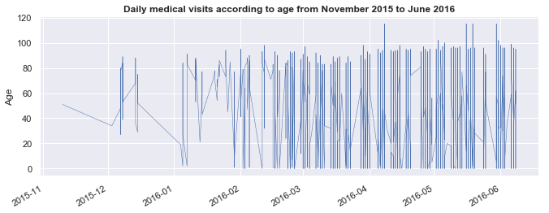


```python
df_appoint_daily.head(1)
```


<div>
<style scoped>
    .dataframe tbody tr th:only-of-type {
        vertical-align: middle;
    }

    .dataframe tbody tr th {
        vertical-align: top;
    }

    .dataframe thead th {
        text-align: right;
    }
</style>
<table border="1" class="dataframe">
  <thead>
    <tr style="text-align: right;">
      <th></th>
      <th>appointment_id</th>
      <th>scheduled_day</th>
      <th>age</th>
      <th>sms_received</th>
      <th>no_show</th>
    </tr>
    <tr>
      <th>day_month_year</th>
      <th></th>
      <th></th>
      <th></th>
      <th></th>
      <th></th>
    </tr>
  </thead>
  <tbody>
    <tr>
      <th>2016-04-29</th>
      <td>5642903</td>
      <td>2016-04-29 18:38:08</td>
      <td>62</td>
      <td>False</td>
      <td>No</td>
    </tr>
  </tbody>
</table>
</div>


```python
ax = df_appoint_daily.loc['2015-12':'2016-01', 'age'].plot(marker='o', linestyle='-')
plt.xlabel('')
plt.ylabel('Age')
plt.title('Daily medical visits according to age from December 2015 to February 2016', fontweight='bold')
```


    Text(0.5, 1.0, 'Daily medical visits according to age from December 2015 to February 2016')


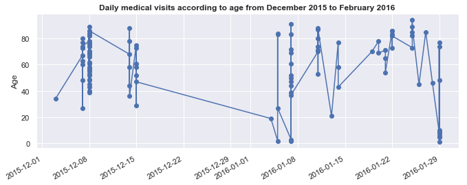


```python
ax = df_appoint_daily.loc['2016-05':'2016-06', 'age'].plot(marker='o', linestyle='-')
#ax.set_ylabel('Daily medical visits according to age')
plt.xlabel('')
plt.ylabel('Age')
plt.title('Daily medical visits according to age from May 2016 to June 2016', fontweight='bold')
```


    Text(0.5, 1.0, 'Daily medical visits according to age from May 2016 to June 2016')


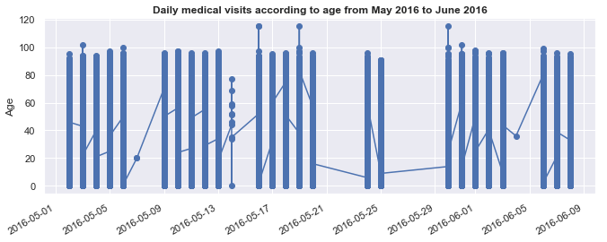


**<span style="background-color:yellow">Conclusion for Exploration 3</span>**  

**The times series plots shown above represent the doctors' visits in the winter and summer.Summer in Brazil runs from December to March and winter from June to September. The plot showing the two month range between December 2015 and February 2016, shows a small number of scheduled appointments. The appointments in the winter deal primarily with people who are older than 30. The plot showing the two month range between May 2016 and June 2016 shows a large number of scheduled appointments. Also, the age range is distributed between age 1 and age 100. The results in the plots leads to the conclusion that people visit the doctor more in the winter than the summer.**  

### <span style="background-color:yellow"> Exploration 4</span>
**4. The relationship between a patient showing up for a doctor's appointment and receiving a text.**


```python
# Count plot of 'No-show' and 'SMS_received' columns
ax = sns.countplot( x="no_show",hue="sms_received",data=df_appoint)
ax.set_ylabel('Number of pateints')
ax.set_xlabel('')
ax.set_xticklabels(['Doctor visit', 'No doctor visit'], fontweight='bold')
plt.title('Number of patients who have visited the doctor or not compared to receiving text or not', fontweight='bold')
without_hue(ax, df_appoint.no_show)
```


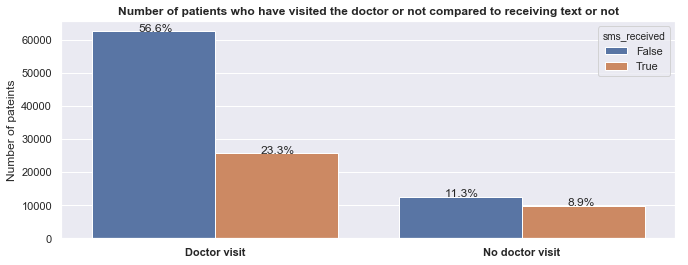


**<span style="background-color:yellow">Conclusion for Exploration 4</span>**

**Text messages are a good reminder for the patient's scheduled doctor's appoinment.  
From the count plot shown above the people who went to the doctor is roughly 80% which is a fairly high percentage. The percent of people NOT texted is roughly 68% which is also high. The percent that were texted is 32.2% which is low. There is no strong evidence to conclude that texting helps with doctor's visits.**

<a id='conclusions'></a>
## Conclusions

**Overall the dataset consisted of fairly young people and children ages 1 to 60. The motivation for the data collection is to investigate the relationship between the variables in the dataset and the patient showing up for their doctor's appointment or not showing up. The conclusion is that given the data on health problems, whether or not the patient received a text,age and gender the patients in general did a fairly good job showing up for their doctor's visit which is 80%.**

**Limitations: It is not known if the same person was accidently given two different patient IDs. To differentiate the patients, variables such as name or birthdate should have been included in this dataset.**


```python
from subprocess import call
call(['python', '-m', 'nbconvert', 'Investigate_a_Dataset.ipynb'])
```
